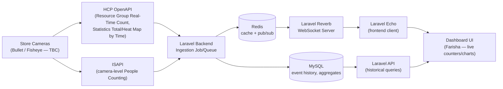

# VisionAI — Retail Dashboard
## System Architecture, Technology Stack & Infrastructure Estimation

**Use case:** Real-time people-counting / foot-traffic analytics dashboard for a retail store
**Data source:** HCP OpenAPI (Artemis) + ISAPI — camera-level people counting
**Candidate cameras:** Bullet Camera & Fisheye Camera *(narrowed, not yet finalized)*
**Team:** Farisha (frontend), Lukman & [you] (backend) — stack not yet set up; only Postman-level API testing completed so far
**Scale / timeline:** *Placeholder — pending confirmation*

---

## 0. Project Background & Scope

This dashboard is built on Hikvision's video analytics ecosystem, with cameras/NVRs managed through HikCentral Professional (HCP). Original requirements were defined by **Mr. Izzat** and scoped entirely around **HCP OpenAPI**. ISAPI was **not part of the original scope**; it is being evaluated only for KPIs HCP OpenAPI does not expose.

| | **HCP OpenAPI (Artemis)** | **ISAPI** |
|---|---|---|
| Layer | Platform-level (HCP server), aggregates all devices | Device-level (camera/NVR firmware), one device at a time |
| Auth | AK/SK, HMAC-SHA256 signed requests | HTTP Digest Auth (camera admin login) |
| Reachability | Reachable wherever HCP is exposed (public IP in this project) | Private LAN only, unless VPN or port-forwarding |
| Status | **Confirmed working** | **Not yet tested beyond Fisheye device-identity calls** |

The two APIs are independent, parallel routes to the same devices; ISAPI does not feed into OpenAPI. OpenAPI is the primary integration path.

---

## 1. System Architecture

### Data flow

### How it works, step by step

1. **Store cameras** generate entry/exit events, reachable via two paths:
   - **HCP OpenAPI** (`aiapplication` people-counting endpoints): real-time group counts and historical statistics. **Confirmed working.**
   - **ISAPI**: device-level counting data/config. **Not yet usable for people counting**; see the open item below and Section 4.
2. **Laravel backend** ingests events from whichever path is used (or both, if OpenAPI is used for aggregated/group stats and ISAPI for device-specific detail), writes raw + aggregated data to **MySQL**, and publishes live updates through **Redis** pub/sub.
3. **Laravel Reverb** picks up Redis-published events and broadcasts them over WebSockets.
4. **Laravel Echo** on the frontend subscribes to those channels, so the dashboard updates **in real time** without polling.
5. **Historical/summary views** (e.g., daily foot traffic, peak hours) are served by a standard Laravel API reading from MySQL, separate from the live-update path — keeps the live pipeline fast and the database from being hit on every single event tick.

### Open item directly affecting this architecture

ISAPI testing so far has only been confirmed working on the **Fisheye camera**, and specifically for device identity (`/System/Video/capabilities`-type calls) — the People Counting module on that camera returned `notSupport`, since HCP's own data shows the **Bullet Camera** is the one actually configured for People Counting. The Bullet Camera's ISAPI port hasn't been confirmed yet. **This needs to be resolved before the ISAPI half of this architecture can be implemented for real** — until then, the OpenAPI path (Resource Group Real-Time Count / Statistics endpoints) is the more reliable data source to build against first.

## ISAPI Status & Blockers

No ISAPI people-counting endpoint has been fully tested yet. Current state:
1. **Credentials: resolved.** Camera-level admin credentials (Digest Auth) have been provided, separate from the HCP AK/SK.
2. **Network / port access: pending.** The camera's ISAPI port came online once but has been unstable since. Testing is on hold until the port status is confirmed. The cameras sit on a private LAN (e.g. 192.168.7.117), so VPN or on-site access is also needed.

Once the port is stable, the first test is the Bullet Camera's People Counting capability, since that is the camera HCP shows as configured for it.

---

## 2. Technology Stack

| Layer | Technology | Status |
|---|---|---|
| Camera / Data Source | Bullet Camera and/or Fisheye Camera (TBC) | Candidates narrowed, not finalized |
| API Layer | HCP OpenAPI (Artemis) + ISAPI | Endpoints identified and tested via Postman; not yet integrated into any backend code |
| Backend Framework | Laravel | Decided, not yet set up |
| Local Dev Environment | Windows + WSL (Ubuntu) + Docker Desktop + Laravel Sail | Decided, not yet set up |
| Database | MySQL (via Sail) | Decided, not yet set up |
| Cache / Pub-Sub | Redis (via Sail) | Decided, not yet set up |
| Real-time Layer | Laravel Reverb (server) + Laravel Echo (client) | Decided, not yet set up |
| Frontend | *(Farisha to confirm)* | Not yet decided |
| Charting | *(to decide — e.g. Chart.js / ApexCharts)* | Not yet decided |
| Containerization | Docker (via Laravel Sail) | Decided, not yet set up |

**Status note:** the whole backend stack is agreed in principle but **nothing has been scaffolded yet** — current work is limited to confirming the right API calls in Postman. Worth flagging this gap clearly if this document goes to a supervisor, so the stack doesn't read as further along than it is.

## KPI Coverage & API Availability

~48 retail KPIs were mapped against what is actually retrievable:

| Status | Count | Meaning |
|---|---|---|
| Yes | 17 | Documented and callable via HCP OpenAPI today |
| Yes (Flagged) | 12 | Callable, but needs Hikvision validation (e.g. Heatmap/Dwell Time can return an empty payload) |
| Partial | 11 | No continuous query on HCP OpenAPI; only via device-direct ISAPI or site configuration |
| No | 8 | No known API path (mainly Re-ID / cross-camera visitor journey) |

**KPIs requiring ISAPI** (not available via HCP OpenAPI): Queue Length, Average Wait Time, Crowd Density, and Passersby (config-dependent; may only need the outdoor line registered as its own camera resource).

**Confirmed working so far (Postman):** AK/SK credentials; `encodeDeviceList` (registered devices: Bullet Camera, TMDA-NVR, TM 80-Cam 3, Kg.Mukut NVR, Fisheye); `cameras`; `statisticsTotalNumByTime`; `resourceGroupRealTimeCount`.

---

## 3. Infrastructure Estimation *(placeholder — pending scope confirmation)*

⚠️ Store count, camera count per store, and timeline are all **unconfirmed**. The numbers below assume a **single pilot store** with the 1–2 candidate cameras currently being evaluated — update once real scope is known.

### Assumptions (placeholder scope)
- 1 store, 1–2 cameras (Bullet and/or Fisheye)
- People-counting events are small (camera/channel ID, timestamp, count) — no video/image data through this backend
- Dashboard viewers: internal/staff-level, not public-facing at this stage

### Estimated compute (placeholder scope)

| Component | Suggestion | Why |
|---|---|---|
| Server | 1 VM — 2 vCPU / 4 GB RAM | Light workload at single-store scale; Laravel + MySQL + Redis + Reverb together fit comfortably |
| Storage | 20–30 GB disk | Small event volume at pilot scale; leaves headroom for logs |
| Network | Standard, no special provisioning | Small JSON events and WebSocket messages, not video streams |

### What would actually change this estimate
- **Number of stores and cameras per store** — the single biggest factor; this estimate is a single-pilot-store floor, not a multi-store number.
- **Event push frequency** from the chosen API path (OpenAPI polling interval vs. ISAPI device push) once that's settled.
- **Dashboard viewer count**, if this becomes customer-facing rather than internal.

---

## Key People
- **Mr. Izzat**: defined original requirements/scope
- **Puan Hana**: team lead, reviewing progress and testing
- **Edwin & Shirlin (Hikvision)**: technical contacts on API gaps (Heatmap/Dwell Time reliability, UI-vs-OpenAPI discrepancies)

## Open Questions / Next Steps
- [ ] Confirm with Puan Hana / Mr. Izzat whether ISAPI is in scope for the 4 KPIs above
- [ ] If in scope: request VPN/on-site access and camera/NVR admin credentials
- [ ] Confirm the Bullet Camera's ISAPI port
- [ ] Confirm whether Queue Management and Crowd Density are separate ISAPI modules with their own developer guides
- [ ] Ask Hikvision to validate the "Yes (Flagged)" endpoints live
- [ ] Confirm entrance/zone-to-camera-resource mapping on site (affects Passersby, Visitors by Zone, Capture Rate)
- [ ] Finalize camera choice, scale and timeline (infrastructure numbers are placeholders)
- [ ] Confirm the camera's port status/stability, then begin ISAPI testing (credentials already received)
  - [ ] If ISAPI is in scope: confirm a stable VPN/on-site route to the camera LAN

## Reference Documents
- *Intelligent Security API (People Counting) Developer Guide*
- *HikCentral Professional OpenAPI V3.1.0 Developer Guide* (851 pages)
- Internal KPI-to-API availability mapping spreadsheet (48 KPIs)

*Architecture and API layer reflect what's actually been tested so far (HCP OpenAPI + ISAPI endpoints via Postman). Stack is the team's agreed direction, not yet implemented. Scale and timeline are placeholders pending confirmation.*
